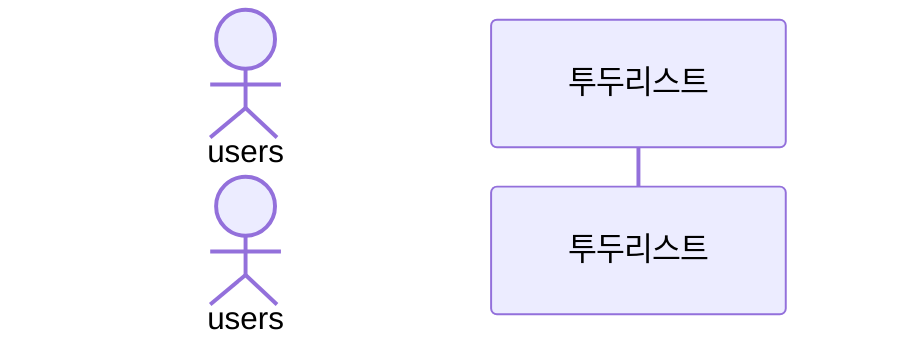

# :sparkles: :white_check_mark: 투두 리스트 :sparkles:

--- 

## :dart: 프로젝트 목표
데이터 접근 기술 중 하나인 JDBC API를 이용한 순수 자바 콘솔 프로그램을 구현한다.  

:heavy_check_mark: 이를 통해, 기본적인 SQL 작성, API 연결 과정을 익히고,  
:heavy_check_mark: SQL 종속적인 데이터 접근 기술의 한계에 대하여 알아보고자 한다.  
:heavy_check_mark: 또한, Spring 프레임워크 없이 순수 자바 콘솔로 mvc 패턴을 구현하는 과정을 체험한다.
---
## :memo: 요구사항 분석 및 설계  

## 시퀀스 다이어그램 

회원가입 
로그인 
투두리스트 조회, 생성, 상태 변경, 삭제
로그아웃

## 클래스 다이어그램  

## ERD 

## 상태 다이어그램 

## :computer: :art:  화면 (UI/UX) 설계   
 

