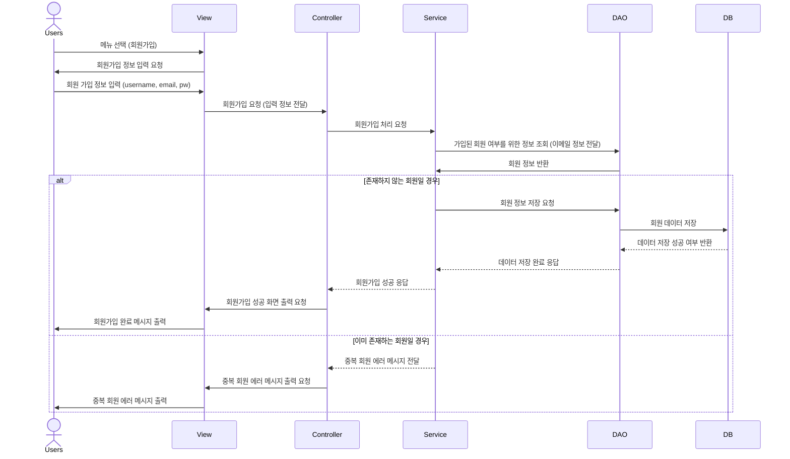
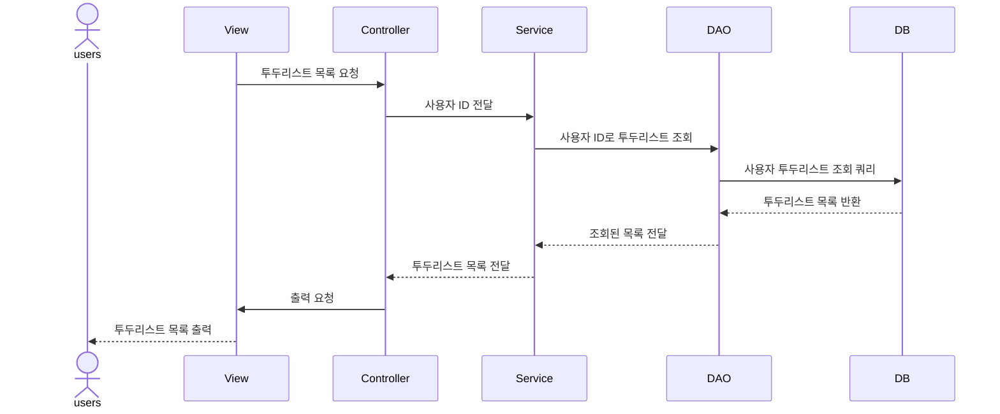
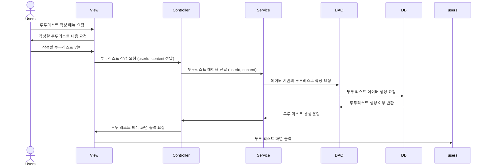
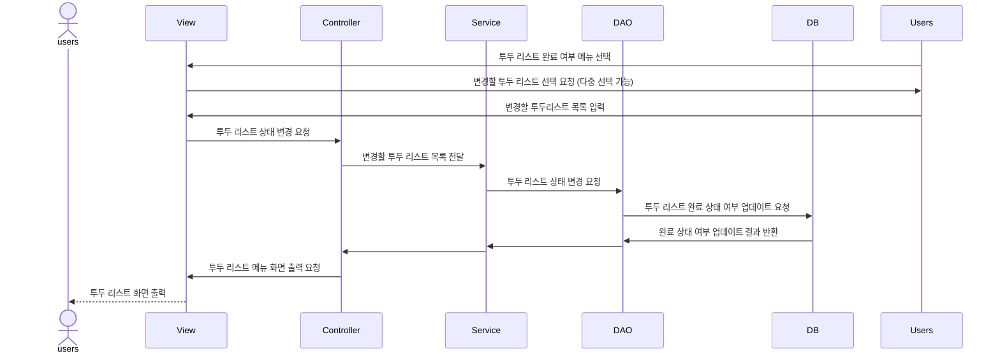
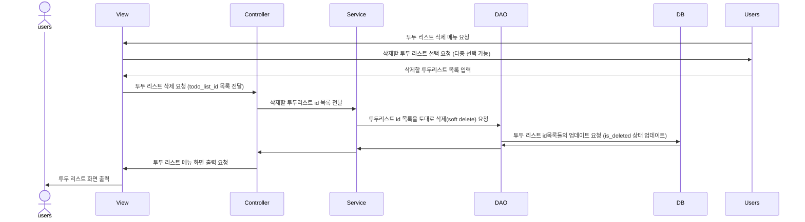

# :sparkles: :white_check_mark: 투두 리스트 :sparkles:

--- 

## :dart: 프로젝트 목표

데이터 접근 기술 중 하나인 JDBC API를 이용한 순수 자바 콘솔 프로그램을 구현한다.  
:heavy_check_mark: 이를 통해, 기본적인 SQL 작성, API 연결 과정을 익히고,  
:heavy_check_mark: SQL 종속적인 데이터 접근 기술의 한계에 대하여 알아보고자 한다.  
:heavy_check_mark: 또한, Spring 프레임워크 없이 순수 자바 콘솔로 mvc 패턴을 구현하는 과정을 체험한다.

---
## :memo: 요구사항 분석 및 설계

## 시퀀스 다이어그램

### 회원 가입

### 로그인

### 투두 리스트

> 투두 리스트 목록 조회, 작성, 완료 여부 상태 변경, 삭제 기능

투두리스트 삭제의 경우 soft delete로 실제 삭제가 이뤄지지는 않는다. (업데이트)  

## ERD

## :computer: :art:  화면 (UI/UX) 설계

|                           최초 화면                           |                              
|:---------------------------------------------------------:|
|  |
|  |

 

|회원 가입|
|:----------:|
|  | 

 

|                            로그인                             |
|:----------------------------------------------------------:|
|  |

 

|                      투두 리스트 화면 (메인 화면)                       |
|:------------------------------------------------------------:|
|   |
|   |
|   |
|   |

 
